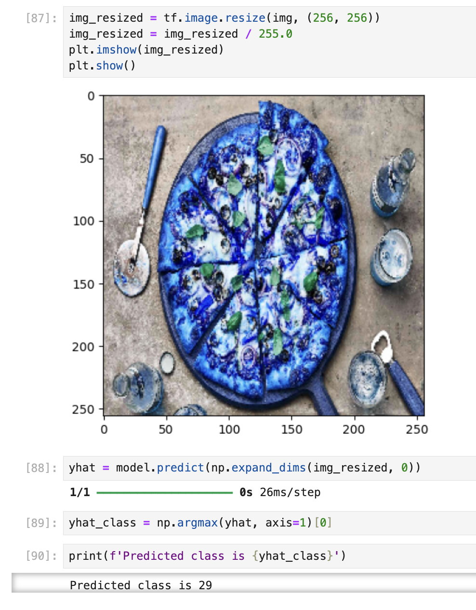

# Image Classifier with Deep Learning CNN

This project involves the development of a Convolutional Neural Network (CNN) model to classify 101,000 images into 101 different categories. The dataset used for training and testing the model is the Food-101 dataset, which contains images of various food items. The model was built using TensorFlow and Keras, achieving a final accuracy of 75% after extensive tuning and optimization.

## Project Overview
This project demonstrates the process of designing, training, and deploying a deep learning model for image classification. The CNN model developed in this project is capable of recognizing and classifying images into one of 101 categories with a significant degree of accuracy.

## Dataset
The dataset used for this project is the [Food-101 dataset](https://www.kaggle.com/datasets/dansbecker/food-101/data), which consists of 101,000 images of 101 different types of food. Each category contains 1,000 images, with 750 used for training and 250 used for testing.

## Model Architecture
The CNN model was built using TensorFlow and Keras. The architecture includes:

- **Convolutional Layers:** For feature extraction from the images.
- **Max-Pooling Layers:** To reduce the spatial dimensions of the feature maps.
- **Dense Layers:** Fully connected layers to perform classification.
- **Dropout Layers:** To prevent overfitting by randomly setting a fraction of input units to zero during training.

The model was fine-tuned and optimized through several iterations, which included adjusting the learning rate, changing the number of layers, and experimenting with different activation functions.

